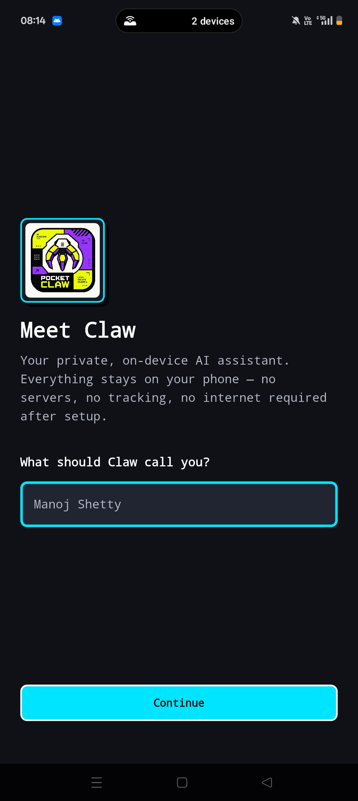
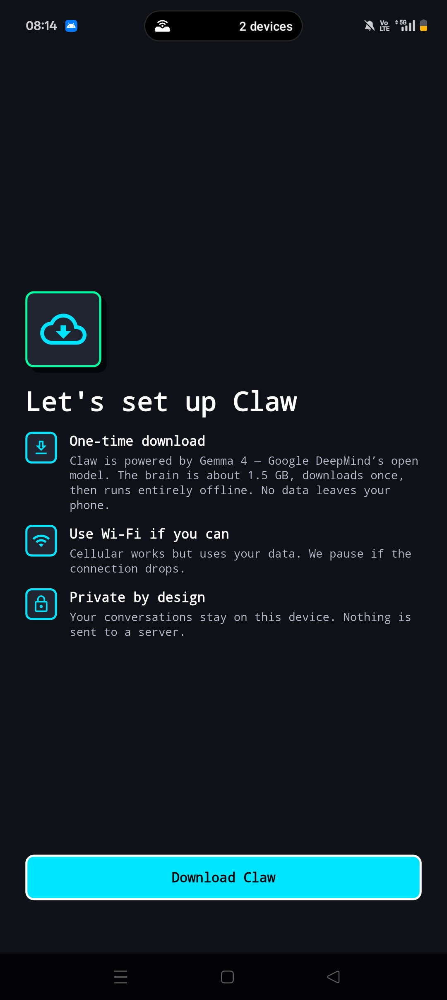
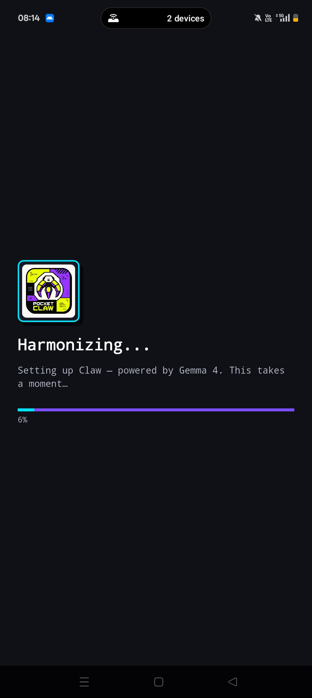

# PocketClaw

An offline, multimodal AI assistant for Android. Chat, voice, vision, document Q&A, and device actions — all running on-device with Gemma 4 E2B. No servers, no tracking, no internet required after first-launch model download.

Built solo for the [Gemma 4 Challenge](https://dev.to/challenges/google-gemma-2026-05-06) — May 2026.

  

## What it does

- **Chat with Claw** — typed or voice (press-and-hold mic with live transcription)
- **Image understanding** — attach a photo, ask anything about it; Gemma 4 multimodal handles it
- **Document Q&A (RAG)** — upload `.txt`, `.md`, or `.pdf` files. PocketClaw chunks, embeds via Gecko 110M, stores in a local sqlite-vec store, and retrieves relevant context for your questions
- **Device actions** — natural language → native Android intents:
  - Flashlight on/off
  - Set alarms / appointments
  - Open dialer or compose SMS
  - Calendar events
  - Open location settings
  - Web search via your browser
  - Local notifications
- **Multi-conversation chat** with persistent history (Hive)
- **Context-compaction engine** — older messages are summarised into a lightweight fact list so long chats don't blow the context window, and old image bytes are dropped from memory once Claw has described them

## Stack

| Layer | Choice |
| --- | --- |
| Framework | Flutter 3.41 / Dart 3.11 |
| LLM | Gemma 4 E2B (INT4, ~1.5 GB) via `flutter_gemma` + MediaPipe LLM + LiteRT-LM |
| Embedder | Gecko 110M (INT8, ~110 MB) for RAG |
| Vector store | sqlite-vec (HNSW) on-device |
| Speech-to-text | Android system STT (`speech_to_text` plugin) |
| Device actions | Native Kotlin `MethodChannel` (camera, alarm, dialer, SMS, calendar, notifications) |
| State | Hive for chats, documents, prefs |
| PDF extraction | `syncfusion_flutter_pdf` |
| Theme | Neobrutalistic cyberpunk — hard borders, flat black shadows, monospace, cyan/purple/mint accents |

## On-device, offline, private

- Models download once on first launch (~1.6 GB total) — Gemma 4 E2B + Gecko 110M
- Every inference, embedding, vector search, and chat persistence happens locally
- Network is only used for the one-time model download
- Conversations, documents, vectors — all stored in app-private storage; nothing leaves the device

## Build

```bash
flutter pub get
flutter run -d <device-id>            # debug
flutter build apk --release           # release APK (~152 MB)
```

Release APK is `arm64-v8a` only with image-generation and WebGPU libs excluded — see `android/app/build.gradle.kts` for the Gradle jniLibs excludes that trim the binary from 185 MB down to 152 MB.

## Why these models

**Gemma 4 E2B over E4B**: E2B fits in <1.5 GB of RAM headroom on mid-range phones (tested on a Snapdragon 7s Gen 3 / Adreno-class device). E4B is ~2.5 GB and noticeably slower for the marginal accuracy gain on phone-scale workloads.

**Gecko 110M over EmbeddingGemma 300M**: 3× smaller download, comparable retrieval quality at the chunk sizes we use (~1200 chars / ~300 tokens). EmbeddingGemma would only matter at much larger doc corpora.

**Android system STT over Gemma 4 native audio**: `flutter_gemma` v0.15.1 only exposes audio input for Gemma 3n E4B, not Gemma 4 E2B. System STT also gives live transcription as the user speaks, which is a real UX win. The day flutter_gemma exposes audio for E2B, the path collapses to a single multimodal call — that's v2.

## RAG quirks worth knowing

The interesting failure mode: generic queries like "summarise this doc" have no semantic overlap with the actual document text, so vanilla similarity retrieval returns 0–1 hits and Gemma falls back to training-data hallucination.

PocketClaw detects generic intents (`summari`, `tldr`, `explain`, `describe`, `overview`, `the document`, etc.) and switches to **filename-anchored retrieval** — each indexed document's filename is itself a distinctive token, and chunks store the filename in their metadata, so searching by filename pulls back chunks reliably regardless of the user's phrasing.

## Status

Shipped for contest. Future ideas live in v2: floating overlay bubble, Gemma 4 native audio (when plugin supports E2B), per-message RAG toggle, full chunk citation in responses.

## License

MIT — see [LICENSE](LICENSE).
